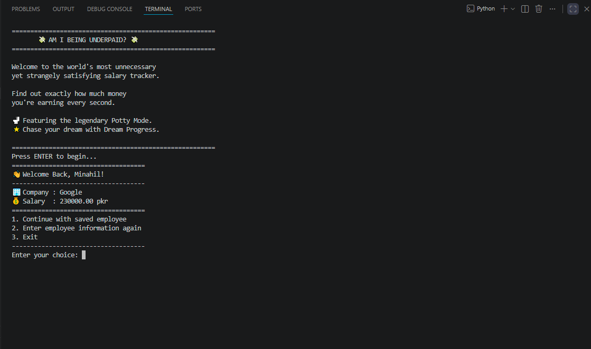
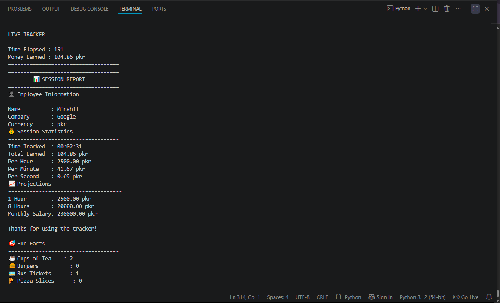
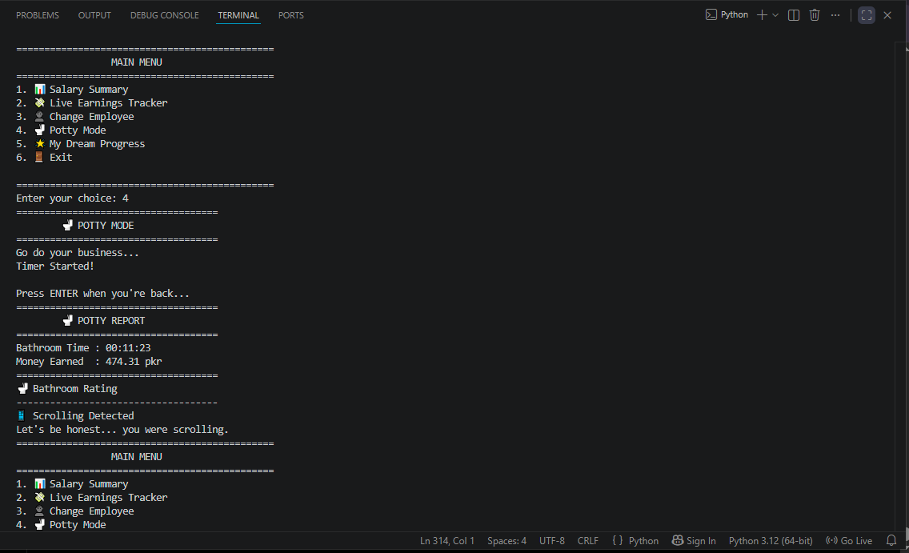
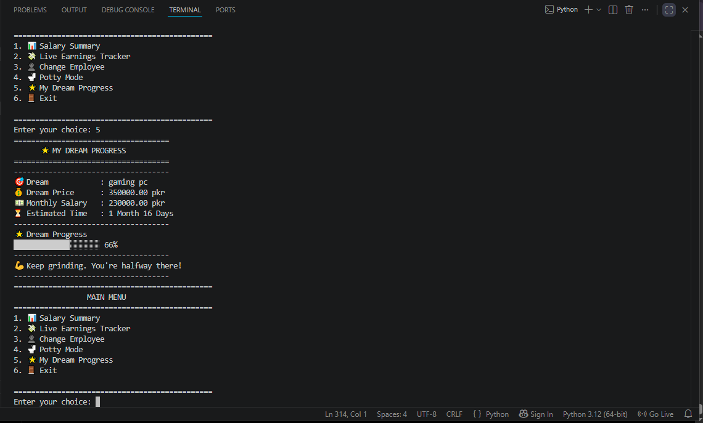

# 💸 Am I Being Underpaid?

A fun and interactive Python application that tracks your salary in real time and answers the question:

> **"Am I Being Underpaid?"**

Instead of simply calculating your monthly salary, this project shows how much money you earn every second, analyzes your salary, tracks your dream goals, and even includes a legendary **🚽 Potty Mode**.

---

## ✨ Features

### 💰 Salary Tracker
- Enter employee information
- Automatic salary calculations
- Per hour, minute and second earnings
- Salary projections

### 📊 Salary Analysis
- Underpaid / Fair Salary / Well Paid analysis
- Helpful advice based on salary range

### ⏱ Live Earnings Tracker
- Real-time earnings display
- Session report
- Hourly, daily and monthly projections

### 🚽 Potty Mode
Because even bathroom breaks earn money.

Features:
- Bathroom timer
- Money earned while away
- Bathroom performance rating

Ratings include:

- ⚡ Speed Runner
- ⭐⭐⭐⭐⭐ Perfect
- 😌 Relaxed
- 📱 Scrolling Detected
- 🏠 New Address Registered

---

### 🌟 Dream Progress
Stay motivated while saving.

Features:
- Save your dream
- Load your dream automatically
- Dream price tracking
- Estimated time to achieve your dream
- Progress bar
- Motivational messages

---

## 💾 Data Storage

The application automatically stores data using JSON files.

- employee.json
- dream.json

---

## 🛠 Technologies Used

- Python
- JSON
- Time Module
- File Handling
- Functions
- Dictionaries
- Loops
- Exception Handling

---

## ▶ How to Run

Clone the repository

```bash
git clone https://github.com/minahilmuqadus/Am-I-Being-Underpaid.git
```

Go into the project folder

```bash
cd Am-I-Being-Underpaid
```

Run

```bash
python underpaid.py
```

---


## 📸 Screenshots

### 🏠 Welcome Screen



---

### 💸 Live Earnings Tracker



---

### 🚽 Potty Mode



---

### 🌟 Dream Progress



## 🚀 Future Improvements

- Multiple dream support
- Salary history
- Charts and graphs
- Currency conversion
- Export reports
- GUI version

---

## 👩‍💻 Author

Made with ❤️ by **Minahil**
